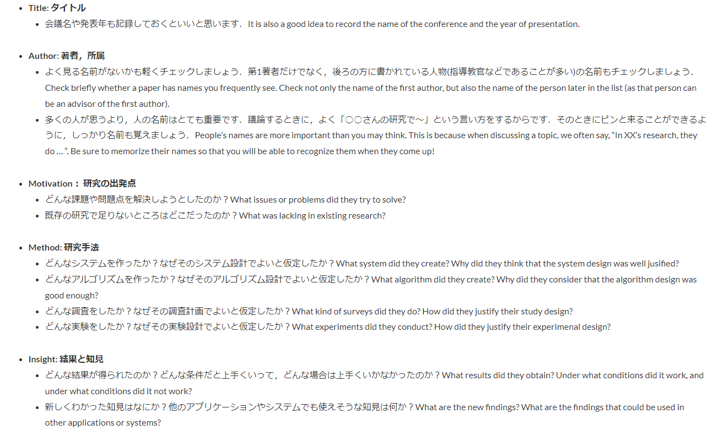
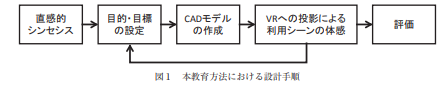
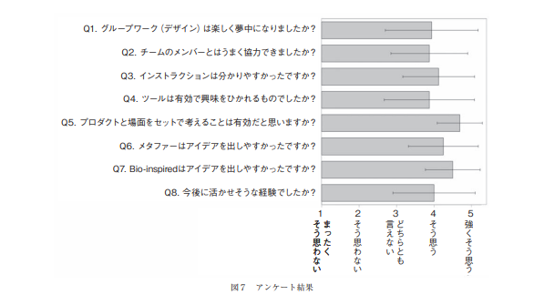

# 先行研究を読んでいくぞ～
- 面白そうな論文を読んでも，すぐ内容忘れちゃうし，使いたいときに思い出せないので，なるべく記録をつけていこうの図
- よくわからんけどググったら矢谷流が出てきたしこれでやるか～
  - https://iis-lab.org/misc/paperreading/

# 記録フォーマット
## Title
### Author: 著者，所属
### Motivation： 研究の出発点
### Method: 研究手法
### Insight: 結果と知見
### (One-sentence) Contribution Summary: 貢献を1行でまとめる

# 記録

## 1.構成的思考力を磨く国際デザインエンジニアリングスクールの実践
### Author: 著者，所属
田浦 俊春
神戸大学大学院工学研究科

嶋田 憲司
Carnegie Mellon University

山田 香織
神戸大学先端融合研究環

妻屋 彰
神戸大学大学院工学研究科

貝原 俊也
神戸大学大学院システム情報学研究科

横小路 泰義
神戸大学大学院工学研究科

佐藤 隆太
神戸大学大学院工学研究科
### Motivation： 研究の出発点
すでに存在するモノ同士をくっつけて新しいアイデアを考える構成論的思考を重視して，デザインワークショップを作ってみよう！
### Method: 研究手法
- 生物と製品の組み合わせからアイデアを考える
- デザインを考えた後，VR空間でプロダクトの生活シーンにおける活用の仕方をシミュレーションする
  - しかも多人数で映像が共有できる

- 日本人学生2名＋アメリカ人２名の４名チームが４つ計１６名
- デザインワークショップ後にアンケートでどうだったかきく
### Insight: 結果と知見
- 4つのうちひとつのグループのアイデアは全く前例がないものになった（独創的になれている？）
- アンケート結果もいい感じ

### (One-sentence) Contribution Summary: 貢献を1行でまとめる
- 構成論的思考を重視して，生物と製品の組み合わせからアイデアソンしたら割といい結果になったよ☆

## 2.Augmeted Reality for Maintenance Tasks with ChatGPT for Automated Text to Action
### Author: 著者，所属
- Fang Xu,Tri Nguyen,Jing Du
- ICIC lab University of Florida
### Motivation： 研究の出発点
- O＆Mにおいて，普通はテキストの作業指示書から特定の装置操作を行うが，テキストから特定のアクションを想起し，実行に動かすのは難しいし，読むのも大変
- だったら，テキストの作業指示書を勝手に解釈して，ヴィジュアル的に作業を明示したらええやん！？
### Method: 研究手法
#### システム
- Hololens2で以下のようなシステムを作った

- テキストの指示書を内蔵カメラで取ってOCRで文字を読み取り，ChatGPTに食わせる．
- そのあと，作業順番をChatGPTに吐き出させる

- そのあと，あらかじめ作っておいたデジタルツインの分電盤と置かれたスイッチなどと現実世界の分電盤とアンカーさせ，Hololensを使って場所を図字する．
- 思った通りのプロンプトを吐いてくれるとは限らないので，フォーマット的におかしかったらプロンプト生成をやり直している

#### 評価実験
- 18歳から30歳の人15人に対して行われた
- システムを使う場合とAR＆GPTを使う場合でタスクの実行速度と正確性を評価した
- 各条件はおんなじ人で行われたっぽい？
- あとNASA TLXとTrust Level
  - NASA TLXは心理的負荷を測る指標っぽい
### Insight: 結果と知見
- システムを使った方が統計的に有意に作業が早くなった
- あんまり正確性は変わらなかった
- NASATLXとTrustLevelも有意に差がみられた
  - 心理的ストレスがかかる状況では特に有用っぽいことが得られた
### (One-sentence) Contribution Summary: 貢献を1行でまとめる
- O＆MにおいてChatGPT＋ARで心理負荷が低く迷いなく早く作業ができるシステムを作った

### 所感
- あらかじめデジタルツインとなる分電盤の３Dモデルを作っておかなければならない点が惜しい
- 画像からスイッチとかレバーを認識して，自動的にそれらの場所をMR上にアンカー出来たら強いな～と思った
- 作業における心理的負荷をNASATLXという指標で求めているのは面白い．確かにＭＲ空間上で目印を出して言われたとおりに作業する方が心理的負荷は低そう

## 3.Exploring the Design Space of Employing AI-Generated Content for Augmented Reality Display
### Author: 著者，所属
YONGQUAN HU, University of New South Wales, Australia
MINGYUE YUAN, University of New South Wales, Australia
KAIQI XIAN, University of New South Wales, Australia
DON SAMITHA ELVITIGALA, University of New South Wales, Australia
AARON QUIGLEY, Data61, CSIRO, Australia

### Motivation： 研究の出発点
- AAR(Augmented Augmented Reality)
  https://www.youtube.com/watch?v=40emGrUv02k&t=35s
   
### Method: 研究手法
- 以下のように音声入力によって，テキストと画像の生成をAIを用いて行う．
  - それをSAR(空間上に映像を表示するやり方)，HMD（Hololensを用いて見るやり方），HHD（スマホで映像を見るやり方）の3つの方法で実装した

- 10人の被験者を３グループに分けて，３つの方法を試した後，それぞれの提示方法について話し合った

### Insight: 結果と知見
- イメージ生成は３Dもでるが浮かび上がったほうがいい．
- Hololensは高すぎて実質的なめりっとがない限り買わない
- presentation user と observation userがいて，observation user にとっては他人に自分が見ているものが見えないこと，プライバシー性が大事，そうなるとSARは微妙
- テキスト生成には小さい画面は向かない．そういう意味でスマホは微妙
### (One-sentence) Contribution Summary: 貢献を1行でまとめる
AR＋GenerativeAIに対して，いくつかの提示方法をプロトタイピングを行い，洞察をした．
### 所感
- こんな何人か集めて試してもらいました～って結果が論文になってええんか？
- ただ，手続きの部分では参考になるところもあった
- AR提示方法としてなぜその方式を選んだのか？ということに対するエビデンスとしては役に立ちそう

## 3. Memory Manipulations in Extended Reality.
- https://imt.hal.science/hal-04058016/file/MemoryManipulationsInExtendedReality_Bonnail.pdf
### Author: 著者，所属
Elise Bonnail, Eric Lecolinet, Wen-Jie Tseng, Mark Mcgill, Samuel Huron, JanGugenheime
Telecom Paris, IP Paris
### Motivation： 研究の出発点
- 私たちの記憶には限界がある．なので記憶をとどめるためにカレンダーを使ったりする．しかし記憶はゆがむことがある．拡張現実を使えば，記憶を改ざんすることができるかもしれない(Memory manipulation)．なので，この研究では長期記憶に与える影響について記憶の研究者とワークショップを行い４８の記憶操作のシナリオを作成し，論じた．主に倫理的な面からも．
- XRMM：XRMemoryManipulation
### Method: 研究手法
3つのスペキュラティブデザインワークショップを12人の記憶の研究者と一緒に開いた．それぞれのワークショップには2人のXR研究者と2人の記憶研究者がいた．XRMMに関しての48のシナリオができ，良いものについては深ぼって議論した．
シナリオでは、次のような特定の質問に焦点を当てた
- アプリケーションを誰が使用するのか、操作はどのように行われるのか
- どのような認知プロセスに基づいて、XRの機能としてどう利用されるか

- 3つのワークショップは以下のように，記憶の改ざんの過程によってクラス分けされた

- 長期記憶の歪みは3つの過程を経て行われ，その介入に適したテクノロジーと介入の仕方は異なる
  - At Encording
    - 実際にそのイベントが起きていて，記憶を書き込むとき
    - ARを使って注意をコントロールしたり，感情を呼び起こす
  - Pre Retrival
    - 記憶を書き込んでから思い出すまでの間
    - ARとVRを使って記憶の目印を消したり，ストレスをかける
  - At Retrieval
    - 記憶を思い出すとき
    - VRを使って何かしらを表示したり，提言をして記憶をゆがめる

### 記憶についての前提知識

- 記憶を外部デバイスに頼りすぎると色々と悪影響が出る可能性がある
  - デバイスなしに記憶をエンコード（思い出す）ことができなくなる
  - 外部デバイスのデータの改ざんによって，記憶が改ざんされる（本当に攻殻機動隊みたいだ！）

### Insight: 結果と知見
#### ENCODING時のXRMM
##### 感情を引き起こすことによるXRMM
- 強烈な感情は鮮明に正確に記憶することに役立つ
- しかしストレスや恐怖は記憶を強めたり変質させたりする
- 例えばVRで教習所の訓練をしている途中に事故を起こすなどすれば記憶を強化できる
- XRを使って強烈なポジティブな感情を引き起こせば，記憶を強化できる
##### 注意をコントローすることによるXRMM

- 物忘れは記憶する事に対して向ける注意が足りないことにより起こる（何か考え事をしていたり注意散漫だったり）
- それを防止するのがこの上記のシナリオ
  - 注意を向ける対象は強調する
  - 注意を向ける対象以外をぼやかす
##### 注意を引き起こすXRMMに対しての考察
- 感情を引き起こすという意味ではXRを使わずともスマートフォンとかでもいいじゃん？という話はあるがフルダイブのVRはリアルな体験に近い鮮明な感情を引き起こすことができることが実証されてる
- 注意のコントロールについてもノイキャンのヘッドフォンやスマートフォンの集中モードなどが存在するが，視覚における注意コントロールという意味ではXRが非常にユニークである
#### AT RETRIEVALにおけるXRMM
- 記憶を保存しておく間も新しい記憶が保存されることによって古い記憶もダイナミックに変動する
- XRを反復ツールとして使えば過去に起きたことの記憶を持続させたり，過去の記憶に対しての苦しさを緩和させたり，記憶を補正することができる

##### 反復による知覚への影響
- ポジティブな記憶を反復することは人を幸福にしたりポジxてぃぶにする
- ネガティブな記憶を反復することはつらい記憶に対する耐性をつけることに長期的に見れば役立つ
- シナリオ”Therapy”では過去の体験を再現したVRを患者に体験させ，セラピストとそれについて議論する
- シナリオ”トラウマの記憶”では患者のトラウマの記憶にセラピストがVRでダイブすることによって患者のトラウマを探る
##### 提案によって記憶をねじまげる
- 思い出すときに間違ったものを思い出してしまうのは，記憶のソースを引き出すときに間違った目印を使って思い出してしまうので違う記憶が引っ張り出されてしまう
- シナリオ”Buy afriend”ではマイケルの過去のイベントを再現したVR映像を友達（例えばジム）とシェアする，ジムはイベントの仮想映像に自分のアバターをもぎりこませることができる

- マイケルが後でこのアプリを通してイベントを振り返るとき，いなかったはずのジムがそこにおり，マイケルの記憶がゆがめられるかもしれない．（結果ジムとマイケルは仲良くなれるかもしれない）

#### AT RETRIVALにおける考察
- このシナリオではイベントを３Ｄ映像として残す技術が必要
- 生成ＡＩなどを使えば将来可能かもしれない
- また動画や写真でもこの介入は可能だが，VRのほうが思い出させる力は動画や写真より高いという研究もある
- この技術は過去の記憶に対してポジティブな印象を持たせたり，記憶が生み出す苦しみを軽減させることができるかもしれない
- しかし，誰かからお金を盗むのに使うなど，悪意ある使い方も可能である
#### Pre Retrival時のXRMM
##### 記憶の目印を隠すことで物忘れを誘発させる

- シナリオ”AR Eraser”では記憶のはかなさを利用して，早く消したい記憶を消すのを手伝う
- 上の絵のように現実世界の消したい記憶（例えば彼女とのファーストキスの写真など）に関するオブジェクトをARで消すか別のものに置き換える
- こうやって記憶を呼び起こすものを視界から排除することにより，記憶の早期劣化を促す（これは面白い！！）
##### ストレスをかけることで物忘れを誘発させる
- あるワードを思い出したいのに思い出せない時，これを記憶のブロッキングというがブロッキングはストレスによって発生することが言われている
- シナリオ”False training app”はVR空間上でストレスがかかる環境（ユーザーの間に雲をかけるとか）を作り出し，そこでユーザーの記憶に関するテストを行うというもの．
#### Pre trieval時のXRMMにおける考察
- これらのシナリオを実現するにはAIが必要（生成AIとか）
  - これ次作ろうかな．．．
- FalseTrainingAppはスマホのアプリでもできるがXRならより没入した体験になり効果が大きくなる可能性がある

### (One-sentence) Contribution Summary: 貢献を1行でまとめる
- XRを用いた記憶操作において,Encording(記憶するとき),Pre Retrival(記憶してから思い出すまでの間), Retrival(思い出すとき)の3段階に分けて，効果的なシナリオを提案した
### キーワード
Transience:記憶にアクセスできなくなること
XRMM：XRMemoryManipulation，XRを使って記憶を操作すること
AbsentMindness：物忘れ

###　感想
- 正直最近読んだ論文の中で抜群に面白かった
- XRを使った記憶操作とか発想がマジでサイバーパンク，クレイジー，最高．
- XR研究者だけじゃなく記憶の研究者と組んでワークショップを開いたゆえに出てきたアイデアでよかった．
  - やはりＸＲを真面目に考えたら人間の記憶の仕方など医学的な知識は必須なんだなぁと思った
- しかも実装できそう（AR Eraserとかちょっと作ってみたい）
- ワークショップをして，ＸＲの可能性を提案しただけでも論文になるんか．．．という発見があった．

## E-ScootAR: Exploring Unimodal Warnings for E-Scooter Riders　in Augmented Reality
### Author: 著者，所属
Andrii Matviienko Florian Müller Dominik Schön
matviienko@tk.tu-darmstadt.de forian.mueller@if.lmu.de Régis Fayard
Technical University of Darmstadt LMU Munich Technical University of Darmstadt
Darmstadt, Germany Munich, Germany Darmstadt, Germany
Salar Abaspur Max Mühlhäuser
Yi Li max@tk.tu-darmstadt.de
Technical University of Darmstadt Technical University of Darmstadt
Darmstadt, Germany Darmstadt, Germany

### Abstruct
電動キックボードは，重要な移動手段となりつつあるが，それに伴い他の車両とぶつかる事故も増えている．この研究では他の車両とぶつからないようにユーザーに知らせる手法として，ARグラスによる表示，ハンドルへのバイブレータによるフィードバック，ARグラスからの音によるフィードバックの３つを提案し，ARグラスによる表示と他の条件での表示について事故率，安全と感じるか？，反応率を比べた．その結果,ARと音による警告が反応時間，安全と感じるか？についてバイブレーションの条件よりもよくなった．また，音による警告は他の2タイプと比べてユーザーに受け入れられやすいことがわかった

### Motivation： 研究の出発点
Micromobilityが注目されるにつれて，交通安全の問題が大きくなってきている．
これに対処するために，自転車ではヘルメットに交通事故を回避するシステムを搭載するアプローチがある．
ここで，作者たちは単一モーダルの刺激をE-Scooterの安全のために役立てることを考えた．
### Method: 研究手法
13人の協力者に対して，ARによるシミュレーション環境下で，（１）ARによる警告，（２）バイブによる警告，（３）ARグラスからの音による警告のどれが危険回避に役立つか評価した
ARシミュレーション環境はARグラスによって，完全にバーチャルな世界を見せて安全な実験環境を作るために使用された．
この実験では危険への反応時間が短いこと，事故率が低いこと，安全か感じるかどうか？を評価した．
実験には19歳から60歳の13人の男女（女２男性11）が参加した．

実験条件は（１）ARによる危険提示，（２）音による危険提示，（３）ハンドルのバイブレーションによる危険提示，（４）刺激を提示しないベースライン条件の４つで行われた

実験中，被験者は空の駐車場に置いてあるE-Scooterに乗り，ARグラスによって図のようなバーチャルな都市の映像を見させられた．安全の理由から，現実世界の可視性を重視するためARグラスによる都市映像という手法が取られた
#### Keywords: 用語
unimodal: ユニモーダル，単一のモーダル
### Insight: 結果と知見
### (One-sentence) Contribution Summary: 貢献を1行でまとめる