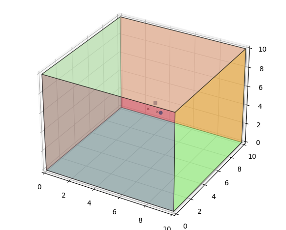

# Todo
- まずは手段によらないシステム図に落とす
- 音源分離やビームフォーミングの要素技術について，本を使って実装しながら学ぶ
- ラズパイ＋Respeakerで実装

## 研究の進め方
- 実際に収録した音声信号を用いて課題を発見する
- シミュレーションにより解決策を模索
- 実際に収録した音声信号を用いた実験でその解決策を確かめる

# 音声分離・ビームフォーミング勉強
## 最適化に関する技法
- 音源分離ではほしい信号が満たすべき性質を定義して，その性質をどのくらい満たすか？を目的関数として設定する
- ほしい信号が満たすべき性質の定義とパラメータの自由度を確定させるためモデルの導入が必要
- パラメータの値の取りやすさに関する事前モデルを事前分布（プライヤ）という
- 制約がある場合のパラメータ最適化問題を制約付きパラメータ最適化問題という
  - ラグランジュの未定乗数法

### 凸関数最小化
#### 凸関数の性質
- 前後の点よりも小さい「くぼみ」があったとすると，それは一点であり，かつ関数f(Θ)の最小値である
  - くぼみとは勾配がゼロであること（Θで微分したときに0)
- 凸関数かどうか判定するには？
  - 元々の関数を２回微分したあたいが０以上となるか確かめる
- 凸関数かどうか判定するのを複素数の場合に拡張すると
  - ヘッセ行列のすべての固有値が０以上であればよい
  - 最適化したい対象が凸関数かどうかヘッセ行列で判定し，凸関数であれば勾配を求めてその勾配が０となる点を求めれば，それが最小値

### 確率・統計的なフレームワークに基づくパラメータ最適化
- 最ゆう度に基づく方法
  - ゆう度関数を最大化するようなパラメータΘを求める
  - ゆう度関数：観測された入力信号が出現した確率


## 複数pythonのver変更
- 今回はpython3.9でやりたいが私のPCにはpython3.9と3.11が入っている
- pipでなんかインストールするときも下記のように実行時もバージョン指定がいるらしい
  - py -2.7 -m pip freeze
- py --list-pathsで現在インストールされているpythonのリストが見れる
- https://qiita.com/landwarrior/items/1b5e0f9af5316a025fe0

## 環境構築
- python 3.9
- 各ライブラリを下記コマンドでpipから落とす
  - py -3.9 -m pip install numpy
  - py pip install scipy
  - py -3.9 -m pip install matplotlib
  - py -3.9 -m pip install sounddevice
  - py -3.9 -m pip install pyroomacoustics
  - py -3.9 -m pip install nara-wpe

## pythonの行列
- http://www.me.cit.nihon-u.ac.jp/lab/yanagisawa/for_student/robobe2_1.html
- 行列の表記
  - ２行４列の行列（２×４行列）の作成方法は以下です。arrayに対して１行目「11,12,13,14」２行目「21,22,23,24」の値を渡します。
```python
arr3 = np.array([[11,12,13,14],[21,22,23,24]])
```
- アインシュタインの縮約記法
  - https://www.youtube.com/watch?v=IsN5VdW9UxM

- reshape関数の説明

  - https://deepage.net/features/numpy-reshape.html
- 3次元行列のイメージ
  - https://qiita.com/ken_yoshi/items/4cbe3abb7d46c5252fdd

# pyroomacousticsで室内の音の反響をシミュレーションしてみる
- しつないで収録したインパルス応答（室内伝達関数）のシミュレーションを行うライブラリ
  - 音源とマイクロホンの位置関係を自由に変化させて，作り出す音のバリエーションを増やせる
  - 室内伝達関数のシミュレーションには，鏡像法という方法で音の反射をシミュレートする
    - 音の入射角と反射角が等しくなることを利用して仮想のへやを作り，音の反射を模擬する
  - pyroomacousticsを用いて室内伝達関数のシミュレーションとインパルス応答の畳み込みを行うコードは以下
```python
import wave as wave
import pyroomacoustics as pa
import numpy as np

#ラン数の種を初期化
np.random.seed(0)


#畳み込みに用いる音声波形
clean_wave_files=["./CMU_ARCTIC/cmu_us_aew_arctic/wav/arctic_a0002.wav","./CMU_ARCTIC/cmu_us_axb_arctic/wav/arctic_a0002.wav"]

#音源数
n_sources=len(clean_wave_files)

#長さを調べる
n_samples=0

#ファイルを読みこむ
for clean_wave_file in clean_wave_files:
  wav = wave.open(clean_wave_file)
  if n_samples<wav.getnframes():
    n_samples=wav.getnframes() #getnframes:サンプル数
  wav.close()

clean_data=np.zeros([n_sources,n_samples])

#ファイルを読み込む
s=0
for clean_wave_file in clean_wave_files:
  wav = wave.open(clean_wave_file)
  data = wav.readframes(wav.getnframes()) #サンプルの読み込み
  data = np.frombuffer(data,dtype=np.int16) #in16の形に変換
  data = data/np.iinfo(np.int16).max
  clean_data[s, :wav.getnframes()]=data #2次元配列にDataをぶちこむ
  wav.close()
  s=s+1 

#シミュレーションのパラメータ

# サンプリング周波数
sample_rate = 16000

#音声と雑音との比率[db]
SNR=90.

#部屋の大きさ
room_dim = np.r_[10.0,10.0,10.0]

#マイクロホンアレイを置く部屋の場所
mic_array_loc = room_dim / 2 + np.random.randn(3) * 0.1

#マイクロホンアレイのマイク配置
mic_alignments = np.array(
    [
        [-0.01, 0.0, 0.0],
        [0.01, 0.0, 0.0],
    ]
)

#マイクロホン数
n_channels = np.shape(mic_alignments)[0] #今回は2

#マイクロホンアレイの座標系
R=mic_alignments .T +mic_array_loc[:,None]

print(R.T)

#部屋を生成する
room = pa.ShoeBox(room_dim, fs=sample_rate, max_order=0)


#用いるマイクロホンアレイの情報を設定する
room.add_microphone_array(pa.MicrophoneArray(R, fs=room.fs))

#音源の場所
doas= np.array(
    [[np.pi/2., 0],
     [np.pi/2.,np.pi/2.]
     ]
)

#音源とマイクロホンの距離
distance = 1.
source_locations = np.zeros((3, doas.shape[0]),dtype=doas.dtype)
source_locations[0, :] = np.cos(doas[:,1]) * np.sin(doas[:, 0])
source_locations[1, :] = np.sin(doas[:,1]) * np.sin(doas[:, 0])
source_locations[2, :] = np.cos(doas[:,0]) 
source_locations *= distance
source_locations += mic_array_loc[:,None]

#各音源をシミュレーションに追加する
for s in range(n_sources):
    clean_data[s]/= np.std(clean_data[s])
    room.add_source(source_locations[:, s], signal = clean_data[s])

#シミュレーションを回す
room.simulate(snr=SNR)

#畳みこんだ波形を取得する(チャンネル，サンプル)
multi_conv_data = room.mic_array.signals

#ファイルに書き込む
for m in range(n_channels):
    conv_data = multi_conv_data[m,:]
    data_scale_adjust = conv_data*np.iinfo(np.int16).max/20.
    data_scale_adjust=data_scale_adjust.astype(np.int16)
    wave_out = wave.open("./conv_out_{}.wav".format(m),"w")
    wave_out.setnchannels(1)
    wave_out.setsampwidth(2)
    wave_out.setframerate(sample_rate)
    wave_out.writeframes(data_scale_adjust)
    wave_out.close()


```
- ShoeBox関数で模擬的な部屋を設定する
  - room_dim :部屋の参事兼形状を表す
  - max_order : 何回まで反射することを想定するか？
  - absorption：壁での吸収率
- 環境中のマイクロホンの場所をadd_microphone_array関数で設定
  - R:マイクロホンの場所を格納した多次元配列
    - 第一インデックス：マイクロホンの数
    - 第二インデックス：各マイクロホンの3次元座標
- 複数のマイクロホンのことをマイクロホンアレイと呼ぶ
- 上記プログラムを実行し，生成されるconv_out_0.wav, conv_out_1.wavを確認すると確かに２つの音声が混ざった音声が生成されている

- room.plot()で部屋をプロットし，plt.show()で確認
  
- ×印がマイクロフォンの場所
- 大きな丸点・四角点が音源の場所

# 参考
- https://www.wizard-notes.com/entry/python/pyroomacoustics-compute-rir
- https://qiita.com/oozzZZZZ/items/8dd90f17aad100b8ec43