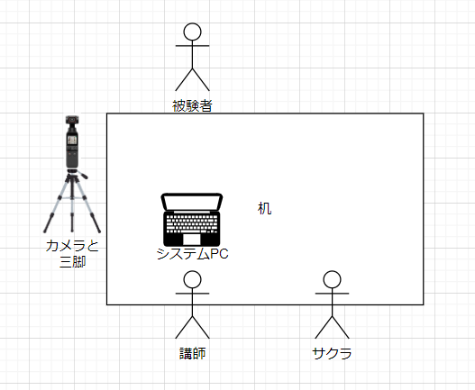

# 研究倫理申請書（仮）
- SI2022のための予備実験計画書
## 課題名
- STTによる音声中のキーワードごとのゲイン調整がタスクの遂行及びその際の身体運動に与える影響の分析
## 研究の概要
　我々は視覚や聴覚を通して、様々な情報を外界から得ている。特に視覚によって情報を得る際には、特定の視覚情報を色を変えて強調したり、Twitterやネットショッピングのレコメンド機能のように、ほしい情報だけをフィルタリングして入手することができる。それに対して聴覚では、外界のノイズを遮断するノイズキャンセリング技術や、デジタル補聴器においては、衝撃音のみをカットする機能や前方の音のみを強調する機能などがある。しかし、視覚のように、特定のキーワードが含まれる会話のみを強調したり、自分に必要のない会話を遮断するような試みは十分に行われていない。これらを行うことによって、周りの情報は担保しつつ、不必要な情報をカットしたり、特にほしいと思っている情報に対しては耳能力を増強させ、効率的に情報を得ることができる可能性がある。今研究では、STTを用いて音声を文章化したのち、特定のキーワードに関わる音声のゲインを調整するシステムを開発し、このシステムがタスクの遂行及びその際の身体運動に与える影響を評価した。
## 研究を行う期間
 2022 8/28 ~ 12/16
## 研究を行う場所
- あいらぼLab@茨木市
- 流通経済大学 新松戸キャンパス 1号館　10階　天野研究室
## 研究の具体的手続きや方法
- 後述の具体的研究実施計画書を参照
## 研究における倫理的配慮

# 具体的研究実施計画書
## 課題名
- STTによる音声中のキーワードごとのゲイン調整がタスクの遂行及びその際の身体運動に与える影響の分析
## 実験デザイン
実験参加者として18歳以上40歳未満の男女を30名を募集する。
本実験は実験者2名と被験者1名の計3名により行われる。ここで実験者2名は実験者1名と実験協力者１名で構成される。実験は対面で行い、実験者の対面に被験者が座り、実験協力者は実験者の隣に座る。
　被験者は実験者から〇〇に関する講義を〇分間聴講する。その際、システムを使用して講義を聴講するシステム使用条件、システムを使用しないで講義を聴講する非システム使用条件を設ける。講義を聴講中、何回か実験者から実験協力者に指示が飛ぶ（今のところをメモに書いてください。カメラをチェックしてください等）その間、講義を一時的に中断する。講義終了後、講義の理解度をチェックするテスト及び、心理アンケートを被験者に対して行う。
## 実験イメージ
  

## 検査・試験内容
### ビデオカメラによる身体活動計測
講義中及び理解度テスト回答中、被験者の斜め前に設置されたビデオカメラにより、各人の東部・胸部運動の様子を映像として記録する。記録されたデータは各人の活動量の産出と評価のために使用される。
### 理解度確認テストによる講義内容理解度の評価
講義終了後、被験者の講義内容に対する理解度を評価するため、理解度確認テストを行う。理解度確認テストの内容としては。講義で説明した内容の記憶を問う４つの選択肢が与えられた選択式問題を10問出題する。
### 心理アンケート調査による講義中の心象の評価
講義終了後、被験者の講義や、実験者・実験協力者に対する印象などを評価するため、心理アンケート調査を行う。