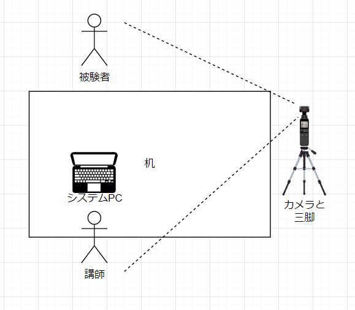

# 研究倫理申請書（仮）
- SI2022のための予備実験計画書
## 課題名
- STTによる音声中のキーワードごとのゲイン調整がタスクの遂行及びその際の身体運動に与える影響の分析
## 研究の概要
　我々は視覚や聴覚を通して、様々な情報を外界から得ている。特に視覚によって情報を得る際には、特定の視覚情報を色を変えて強調したり、Twitterやネットショッピングのレコメンド機能のように、ほしい情報だけをフィルタリングして入手することができる。それに対して聴覚では、外界のノイズを遮断するノイズキャンセリング技術や、デジタル補聴器においては、衝撃音のみをカットする機能や前方の音のみを強調する機能などがある。しかし、視覚のように、特定のキーワードが含まれる会話のみを強調したり、自分に必要のない会話を遮断するような試みは十分に行われていない。これらを行うことによって、周りの情報は担保しつつ、不必要な情報をカットしたり、特にほしいと思っている情報に対しては耳能力を増強させ、効率的に情報を得ることができる可能性がある。今研究では、STTを用いて音声を文章化したのち、特定のキーワードに関わる音声のゲインを調整するシステムを開発し、このシステムがタスクの遂行及びその際の身体運動に与える影響を評価した。
## 研究を行う期間
 2022 8/28 ~ 12/16
## 研究を行う場所
- あいらぼLab@茨木市
- 流通経済大学 新松戸キャンパス 1号館　10階　天野研究室
## 研究の具体的手続きや方法
- 後述の具体的研究実施計画書を参照
## 研究における倫理的配慮

# 具体的研究実施計画書
## 課題名
- STTによる音声中のキーワードごとのゲイン調整がタスクの遂行及びその際の身体運動に与える影響の分析
## 実験デザイン
実験参加者として18歳以上40歳未満の男女を30名を募集する。
本実験は実験者1名と被験者1名の計3名により行われる。実験は対面で行い、実験者の対面に被験者が座る。
　被験者はシステムを装着した後、実験者から〇〇に関するアイデアをA4用紙の所定のフォームに思いつく限り欠くよう指示される。(Alternative Uses Test) 実験者は被験者がアイデアを考えている際にもアイデア出しに対しての助言を与える。タスクを行う際、システムを使用して具体的な指示以外をカットするシステム強適用条件、具体的な指示も余計なアドバイスもカットしないシステム弱適用条件を設ける。アイデア出し終了後、アイデア出しのタスクの印象を問う心理アンケートを被験者に対して行い、アイデアシートを回収する。
## 実験イメージ
   

## 検査・試験内容
### ビデオカメラによる身体活動計測
講義中及び理解度テスト回答中、被験者の斜め前に設置されたビデオカメラにより、各人の東部・胸部運動の様子を映像として記録する。記録されたデータは各人の活動量の産出と評価のために使用される。
### アイデアシート
アイデアの件数や質を評価する
### 心理アンケート調査による講義中の心象の評価
被験者のアイデア出しや、実験者に対する印象などを評価するため、心理アンケート調査を行う。

